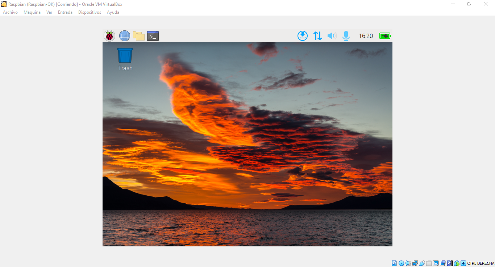
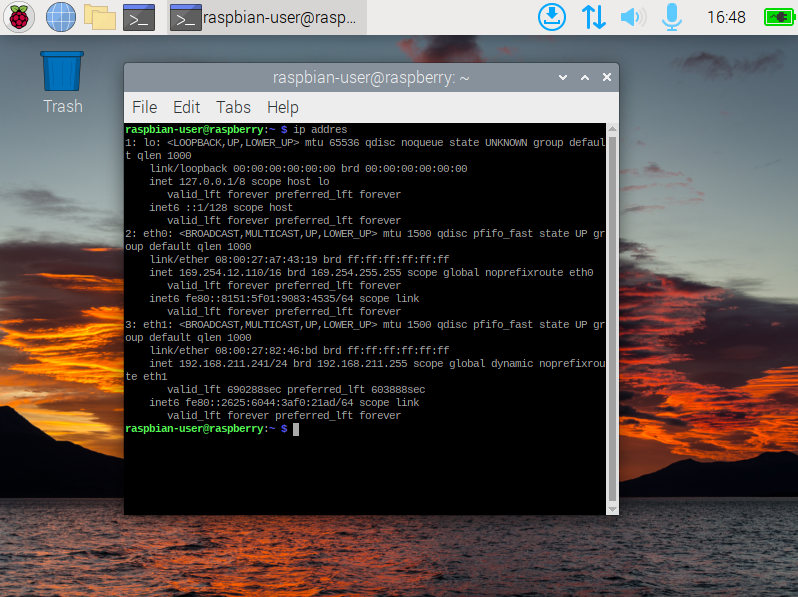
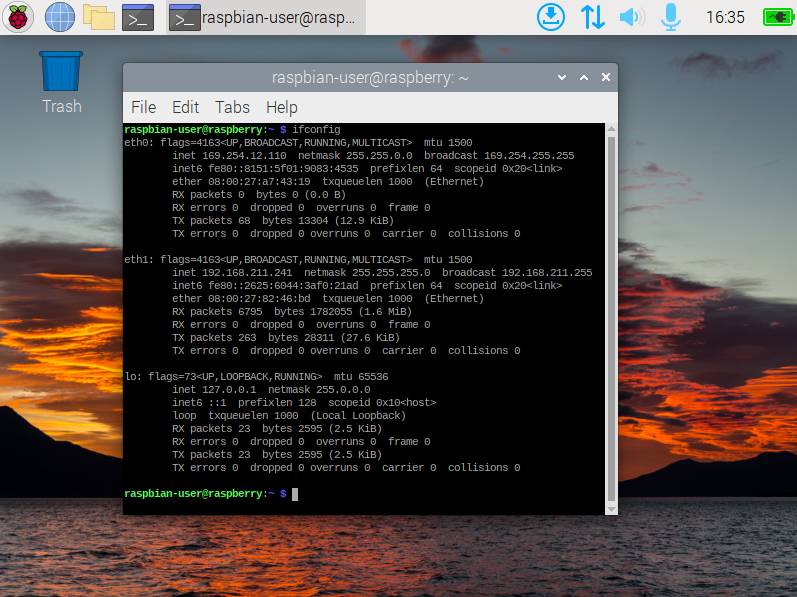
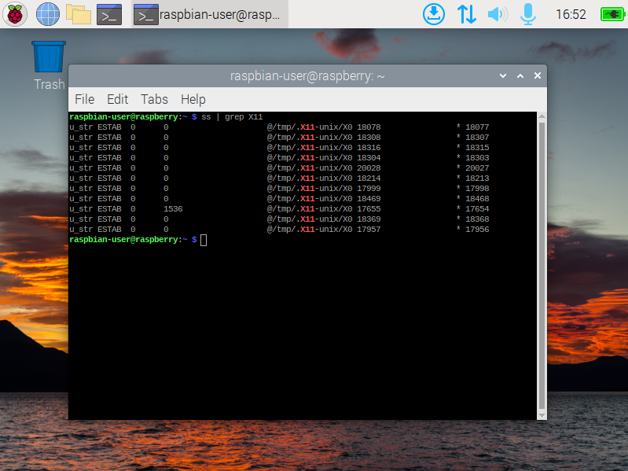
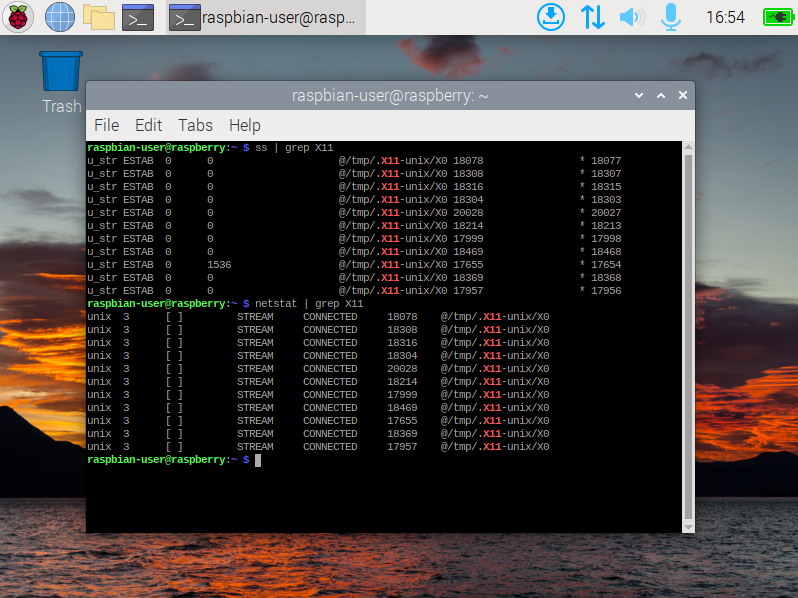
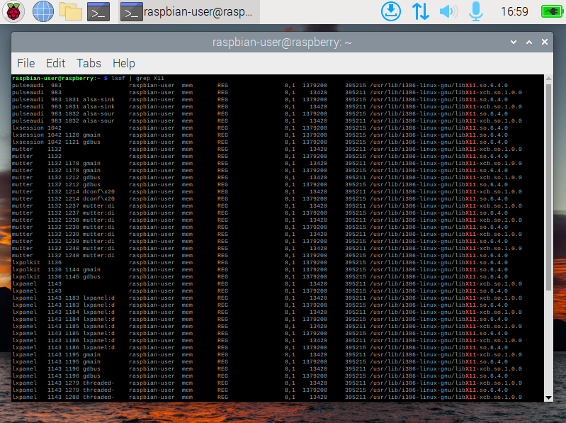
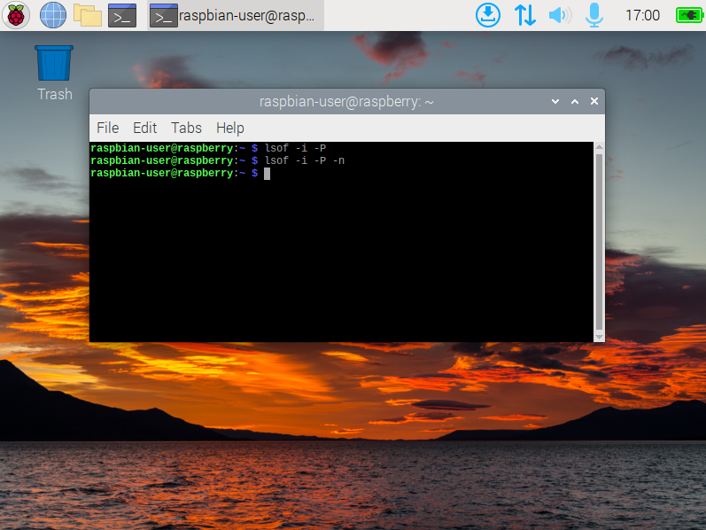
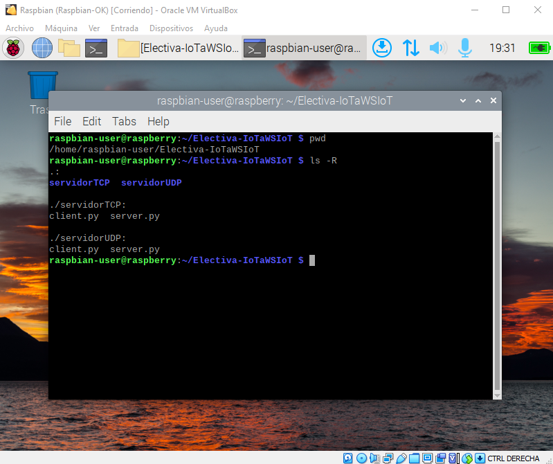
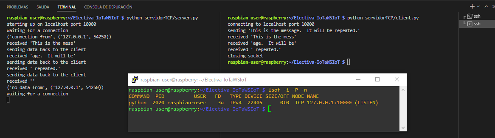
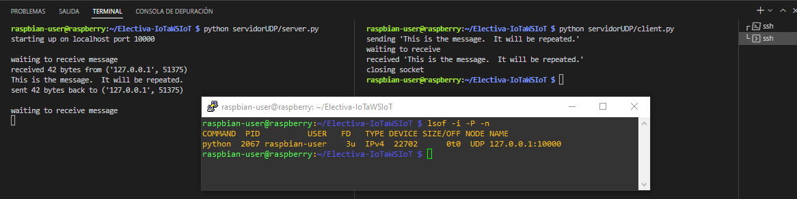

# Práctica 1: Configuración de entorno y red

## Desarrollo de la práctica

1. _Configuración del entorno:  El estudiante deberá configurar su dispositivo de elección para ejecutar una imagen virtualizada de Linux, este será un suministro importante para el resto de prácticas._

     
    Figura 1: Raspbian en VirtualBox. 
    
    En la Figura 1 se observa la instalación de la maquina virtual 'Raspbian' en VirtualBox. 

2. _Instalar docker_ 

    No hubo compatibilidad con Raspbian. Se instalo y reinstalo varias veces el sistema operativo y el paquete docker y siempre genero errores. Se instalo en otro Sistema Operativo y funcionó, probablemente haya sido debido a que raspbian era x32 y el procesador del computador anfitrion es AMD y Docker necesita i386

3. _Reconocimiento de herramientas de red: Identificar configuración de red por medio del comando ip e ifconfig. Identificar servicios y puertos ocupados en el sistema con los comandos ss, netstat y lsof._

    * **_ip_** 

     
    Figura 2: Uso del comando 'ip addres'. 

    * **_ipconfig_** 

     
    Figura 3: Uso del comando 'ifconfig'. 

    * **_ss_** 

     
    Figura 4: Uso del comando 'ss'. 

    * **_netstat_** 

     
    Figura 5: Uso del comando 'netstat'. 

    * **_lsof_** 

     
     
    Figura 6: Uso del comando 'lsof'. 

4. _Identificar servicios desplegados: El estudiante deberá identificar 5 servicios diferentes listados por las herramientas de red y determinar a qué aplicaciones posiblemente están relacionados._ 

    * **/run/systemd/journal/stdout** 

        'systemd-journald' es un servicio del sistema que recopila y almacena datos de registro [[1]](https://www.freedesktop.org/software/systemd/man/systemd-journald.service.html). 

    * **/run/user/1000/bus** 

        '/run/user/$uid' es creado por 'pam_systemd' y se usa para almacenar archivos usados por procesos en ejecución para ese usuario [[2]](https://unix.stackexchange.com/questions/162900/what-is-this-folder-run-user-1000). 

    * **/run/dbus/system_bus_socket** 

        D-Bus es un sistema de bus de mensajes, una forma sencilla para que las aplicaciones se comuniquen entre sí. '/run/dbus/system_bus_socket' es una ubicación del archivo PID y el conector del bus del sistema para el funcionamiento del sistema de bus [[3]](https://www.linuxfromscratch.org/lfs/view/10.1-systemd/chapter08/dbus.html). 

    * **@/tmp/.X11-unix/X0** 

        '@/tmp/.X11-unix/X0' es un socket de dominio donde se conectan aplicaciones hacia un servidor X [[4]](https://unix.stackexchange.com/questions/57138/why-does-my-x11-forwarding-attempt-fail-with-connect-tmp-x11-unix-x0-no-such). 

    *  **/run/dhcpcd.unpriv.sock** 

        'dhcpcd' es una implementación del cliente DHCP especificado en RFC 2131. dhcpcd obtiene el host información (dirección IP, rutas, etc.) de un servidor DHCP y configura la red interfaz de la máquina en la que se está ejecutando [[5]](https://manpages.ubuntu.com/manpages/bionic/man8/dhcpcd5.8.html).

5. _Evaluar scripts en Python: Al estudiante se le entregarán scripts en Python para desplegar un ejemplo de cliente servidor con protocolos TCP y UDP, el estudiante evaluará el rendimiento de los dos servicios y debe descubrir la ocupación de los puertos por medio de las herramientas previamente estudiadas._ 

     
    Figura 7: Directorio de Trabajo de los Servicios. 

    En la Figura 7 se muestra la estructura de los servicios TCP y UDP en la maquina virtual 'raspbian', esta estructura cuenta con una carpeta para cada servicio donde se implementan los códigos de servidor y cliente respectivamente. 

    * **_Servicio TCP_** 

     
    Figura 8: Implementación del Servicio TCP. 

    En la Figura 8 se muestra la implementación del servicio TCP en la maquina virtual linux usando ssh en Visual Studio Code y Putty desde el equipo anfitrion Windows. En Visual Studio Code se ejecutan los archivos y se muestran los resultados, en Putty el rendimiento del servicio donde se muestra el uso del puerto 10000 de tipo TCP, comando python, PID 2020. 

    * **_Servicio UDP_** 

     
    Figura 9: Implementación del Servicio udp. 

    En la Figura 9 se muestra la implementación del servicio UDP en la maquina virtual linux usando ssh en Visual Studio Code y Putty desde el equipo anfitrion Windows. En Visual Studio Code se ejecutan los archivos y se muestran los resultados, en Putty el rendimiento del servicio donde se muestra el uso del puerto 10000 de tipo UDP, comando python, PID 2067. 