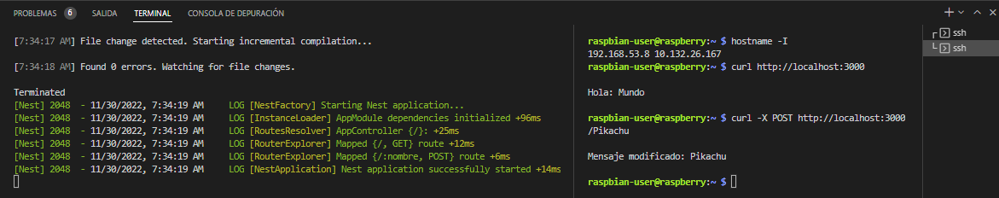
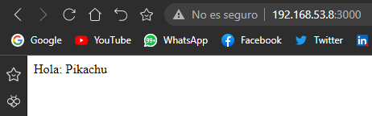
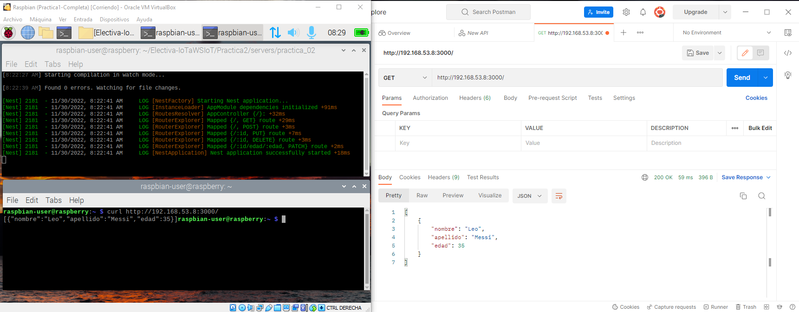
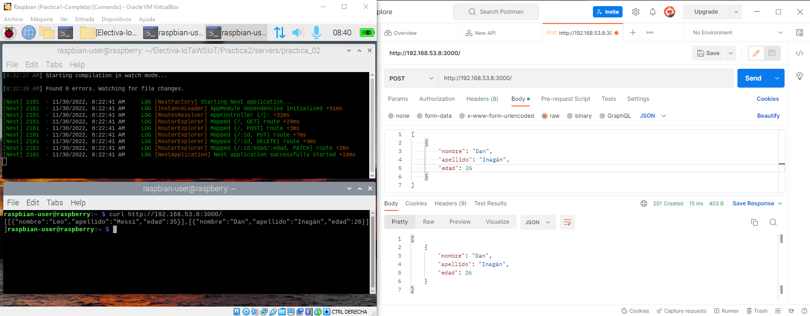
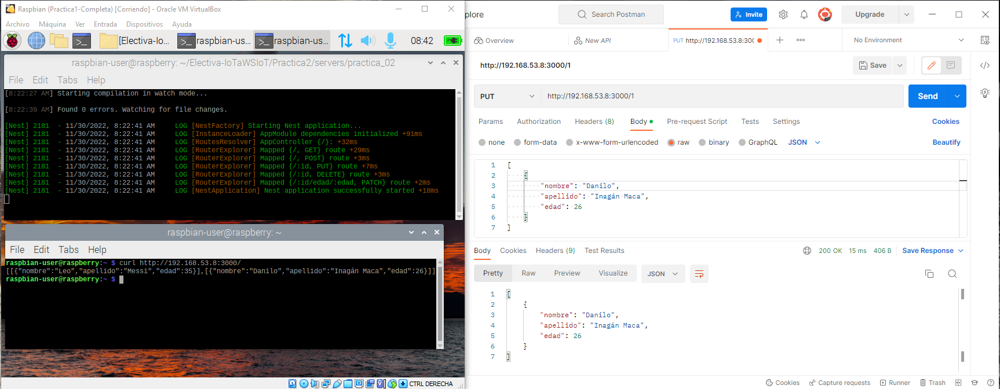
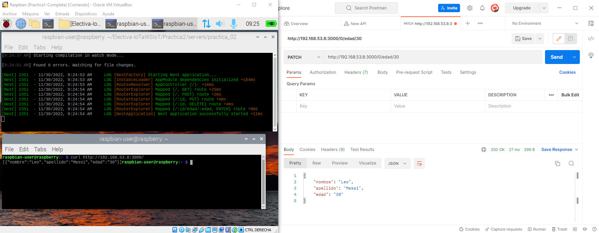

# Práctica 2: Creando un servidor REST 

## Desarrollo de la práctica 

#### I. Instalar NodeJS y NestJS

  
 
 
 
 
 

#### II. Ejecutando el ejemplo Hello World

 
 
 
 
 

#### III. Publicando el código en GitHub

#### IV. Los verbos HTTP

 
 
 
 

Aplicando el Ejemplo sobre Personas  

 
 
 
 
 

Teniendo en cuenta los anteriores codigos implementados y el ejemplo de Personas: 

Entidad Modelo Seleccionada 
<pre><code>
interface GreenHouseState { // Sensors Values  
  identification: number, 
  dateTime: string, 
  sensorValues: {
    temperature: number, // [°C]
    brightness: number, // [5]
    ph: number, // [absolute] 
    humidity: number // [%] 
  }
}
</code></pre>

Valores por Defecto 
<pre><code> 
  private greenHouseState: GreenHouseState[] = [
    { 
      identification: 0, 
      dateTime: '01/01/2022 12:00:00', 
      sensorValues: {
        temperature: 30, 
        brightness: 70, 
        ph: 10, 
        humidity: 20 
      }
    }, 
    { 
      identification: 1, 
      dateTime: '02/01/2022 12:00:00', 
      sensorValues: {
        temperature: 31, 
        brightness: 71, 
        ph: 11, 
        humidity: 21 
      }
    }
  ]
</code></pre> 

Metodos HTTP Implementados 
<pre><code> 
  @Get()
  getGreenHousestate(): GreenHouseState[] { 
    return this.greenHouseState; 
  }

  @Post()
  createGreenHouseState(@Body() data: GreenHouseState): GreenHouseState {
    this.greenHouseState.push(data);
    return data;
  }

  @Put(":index")
  modifyGreenHouseState(@Body() data: GreenHouseState, @Param('index') index: number): GreenHouseState | string {
    try{
      this.greenHouseState[index] = data; 
      return this.greenHouseState[index];
    }
    catch{
      return `No fue posible modificar al GreenHouseState en la posición ${index}`; 
    }
  } 

  @Delete(":indexV")
  deleteGreenHouseState(@Param('indexV') indexV: number){
    try{
      this.greenHouseState = this.greenHouseState.filter((val, index) => index != indexV);
      return true;
    }
    catch{
      return false;
    } 
  }

  @Patch(":index/identification/:identification") 
  changeGreenHouseState_identification(@Param('index') index: number, @Param('identification') identification: number): GreenHouseState | string{
    try{
      this.greenHouseState[index].identification = identification;
      return this.greenHouseState[index];
    }
    catch{
      return `No fue posible modificar al usuario en la posición ${index}`; 
    }
  } 
</code></pre> 

Resultado 

