# Práctica 2: Creando un servidor REST 

## Desarrollo de la práctica 

#### I. Instalar NodeJS y NestJS

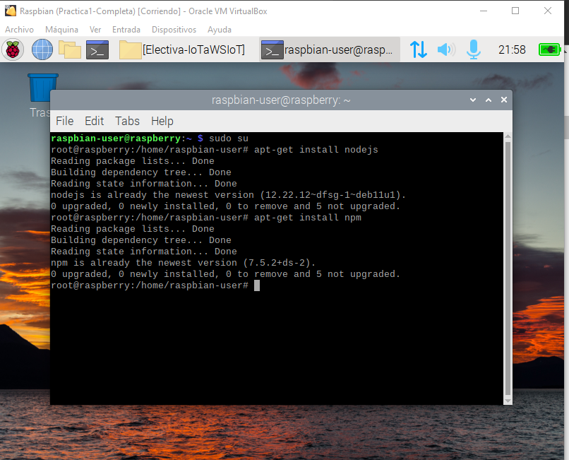  
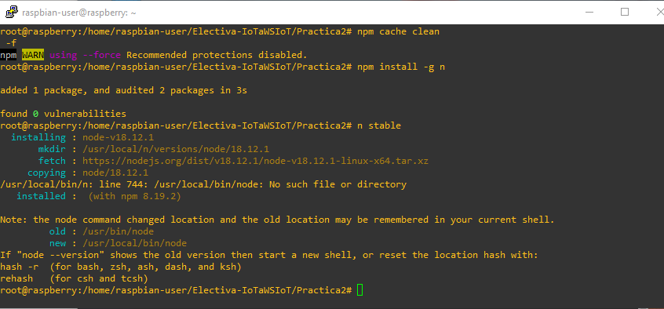 
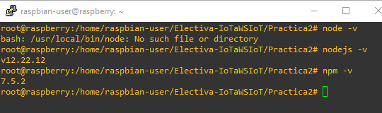 
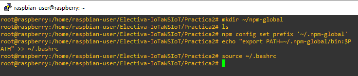 
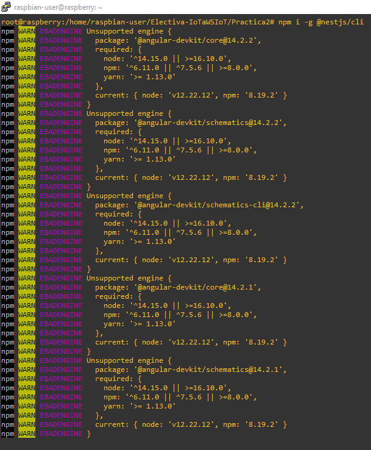 
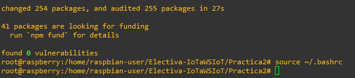 

#### II. Ejecutando el ejemplo Hello World

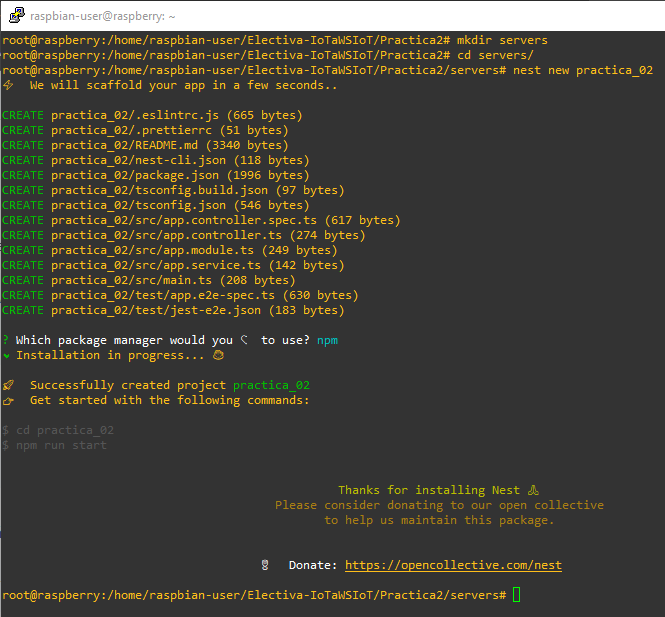 
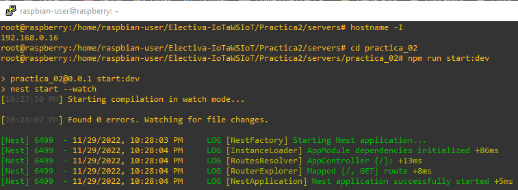 
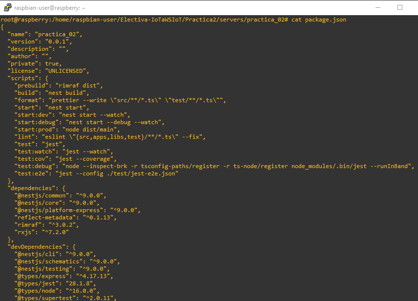 
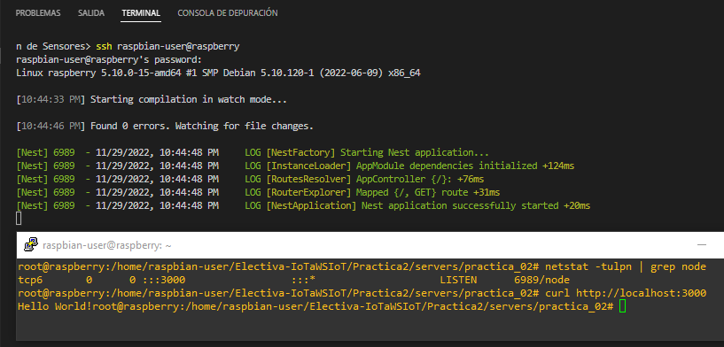 
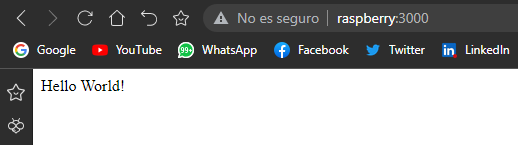 

#### III. Publicando el código en GitHub

#### IV. Los verbos HTTP

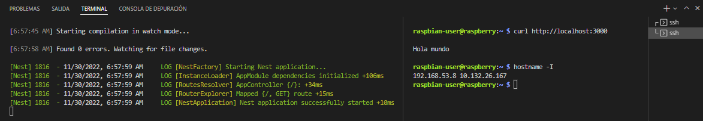 
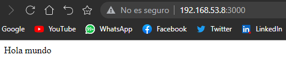 